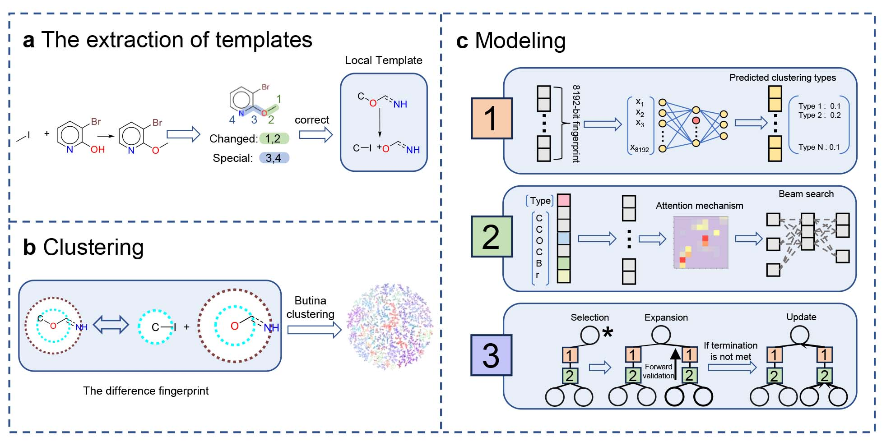

# SynCluster: A reaction type clustering and recommendation strategy for synthesis planning
 
This research proposes an innovative framework named SynCluster to investigate the impact of fine-grained reaction-type labels, rendered by clustering, on downstream tasks.
The directory contains source code of the unpublished article:
Tiantao et al's SynCluster: A reaction type clustering and recommendation strategy for synthesis planning
Note: 1-77 clustering types refer to 0-76 labels in the running.

## Download
```
git clone https://github.com/Yoko1030/SynCluster.git
cd SynCluster
```

## Dataset
USPTO-50K: https://github.com/Hanjun-Dai/GLN <br>
USPTO-500-MT: https://github.com/HelloJocelynLu/t5chem <br>
We have sorted out the original data and the training weights, which can be downloaded from the following address: https://drive.google.com/drive/folders/19pFDvQ31NJMT2kmccFtpFVZ3pfWlU6lf?usp=sharing. 
The data should be put in `clustering/scripts/data`. 
"classifier_best.pth" should be put into `Classifier/models`.
"SynCluster_best.pt" should be put into `model` (not combined with augment and alignment).

## Environment

```
conda env create -f environment.yaml
conda activate SynCluster
```

## Clustering
```
cd clustering/scripts
python 01_data_preparation.py
python 02_template_correction.py
python 03_cluster.py
python 04_output.py
```
## Classifier (not included in reagent's prediciton)
```
cd ../../Classifier/fp
python Train2.py
python out.py
```
## Tansformer data preparation (non-augment)
```
cd ../../preprocess
python preprocess.py
```
## Tansformer Training (non-augment)
```
cd ..
sh train.sh
```
## Inference (non-augment)
```
sh inference.sh
```
The results will be saved in output/output
